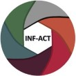

# How to cite FluMut

We are currently writing the paper. 
Until the publication please cite the GitHub repository:
[https://github.com/izsvenezie-virology/FluMut](https://github.com/izsvenezie-virology/FluMut)

# Fundings

This work was supported by FLU-SWITCH Era-Net ICRAD (grant agreement No 862605) and by the NextGeneration EU-MUR PNRR Extended Partnership initiative on Emerging Infectious Diseases (Project no. PE00000007, INF-ACT)

|  |  |  |
