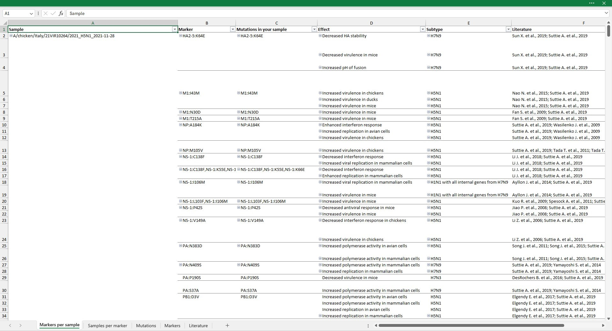
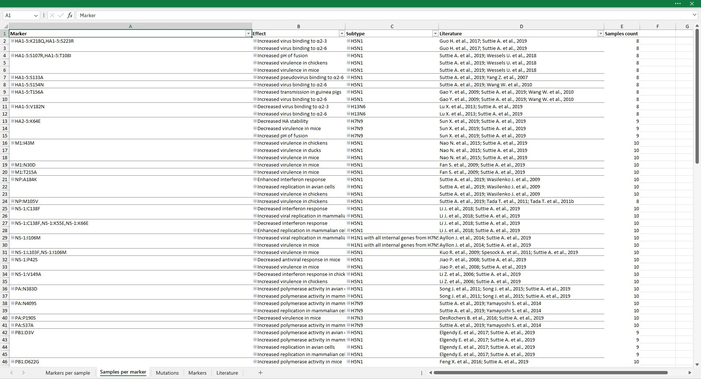
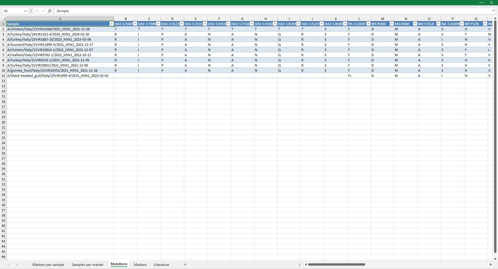
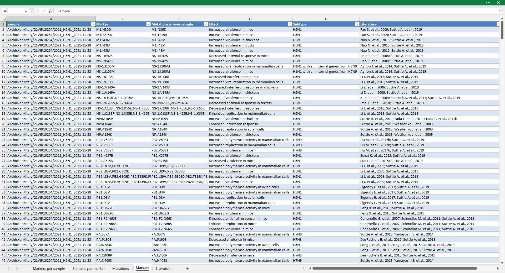
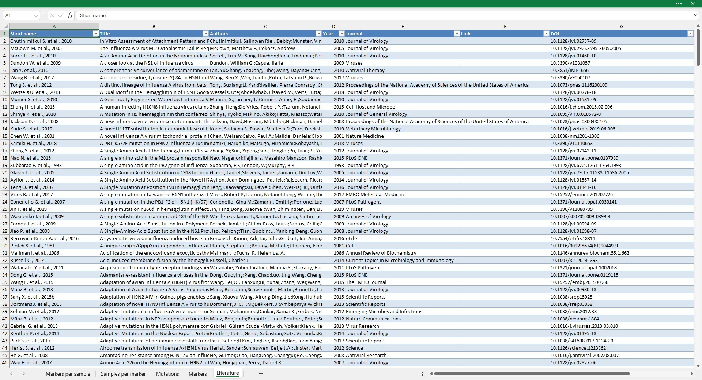

# Excel output
This is the most user-friendly and complete output. 
You can obtain this output using the [`--excel-output` option](usage/usage-cli#options).
It contains 5 sheets:
- [Markers per sample](#markers-per-sample-sheet)
- [Samples per marker](#samples-per-marker)
- [Mutations](#mutations)
- [Markers](#markers)
- [Literature](#literature)

{: .note}
To enable the navigation feature the exstension of the Excel file must be `.xlsm`.
If you don't care about navigation, you can use `.xlsx` exstension.

## Markers per sample
`Markers per sample` reports the list of the identified markers grouped by sample. 
Specifically, it contains six columns:
- **_Sample_**: sample ID;
- **_Marker_**: markers identified in the sequences. 
    If the `--relaxed` option is selected, markers for which at least a mutation composing the marker is identified are reported.
- **_Mutations in your sample_**: mutations composing the marker that are identified in the sequences analysed.
    This column is identical to the column `Marker` unless the [`--relaxed` option](usage/usage-cli#options) was selected.
    With the `--relaxed` option this column allows to inspect which of the mutations composing the marker are identified in the analysed sequences.
- **_Effect_**: biological effects of the marker, as described in the literature.
- **_Subtype_**: influenza subtypes where the effect of the marker has been observed or tested.
- **_Literature_**: bibliographic references where the marker has been described.

{: .note}
By double-clicking on cells in the `Marker` or `Mutations in your sample` columns, you are redirected to the `Mutations` sheet, with columns filtered to display only mutations of selected marker.

{: .note}
By double-clicking on cells containing references in the `Literature` column you are redirected to the `Literature` sheet. 
Rows are filtered to display only papers describing the selected effect.

## Samples per marker
This sheet displays the number of samples in which the marker is observed (column `Samples count`).
If [`--relaxed` option](usage/usage-cli#options) was selected, samples for which at least one mutation of the marker are counted.

{: .note}
By double-clicking on cells in the `Marker` or `Mutations in your sample` columns, you are redirected to the `Mutations` sheet, with columns filtered to display only mutations of selected marker.

{: .note}
By double-clicking on cells containing references in the `Literature` column you are redirected to the `Literature` sheet. 
Rows are filtered to display only papers describing the selected effect.

## Mutations
This sheet shows the amino acid presents in the positions of mutations of interest for each sample.
The mutations are ordered alphabetically by protein name, then by position and then by amino acid mutation.

| blank cell              | no sequence available |
| `-`                     | deletion              |
| `?`                     | undefined amino acid  |
| two or more amino acids | codon codes for alternative amino acids (nucleotide degeneration within the codon causing a nonsynonymous mutation) |

## Markers
The `Markers` sheet lists for each sample, the marker and mutation identified. 
If the marker has multiple effects or it was tested on multiple subtypes it will be composed of different rows (one row per effect/subtype)

## Literature
The `Literature` sheet reports all the references present in the database.

# Markers output 
This output is obtained with the [`--markers-output` option](usage/usage-cli#options). 
The file reports in a tab-delimited value format all the information present in  [Markers](#markers) sheet of the excel output, described above.

# Mutations output
This output is obtained with the [`--mutations-output` option](usage/usage-cli#options).
The file reports in a tab-delimited value format all the information present in  [Mutations](#mutations) sheet of the excel output, described above.

# Literature output
This output is obtained with the [`--literature-output` option](usage/usage-cli#options). 
The file reports in a tab-delimited value format all the information present in  [Literature](#literature) sheet of the excel output, described above.
