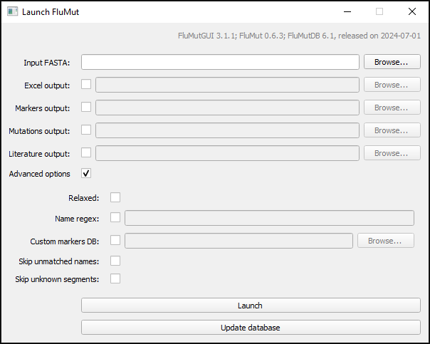

# Basic Usage
FluMutGUI is very simple to use:
1. Update the database to latest version
1. Select the FASTA file you want to analyze (learn more [here](./input-file))
1. Select which [outputs](../output) you want (and change the file name if you want)
1. Launch the analysis

FluMut will analyze your samples and will create the selected outputs.
When it finishes check the messages and then you can close the program.

# Advanced options
You can use all [advanced options](docs/usage/usage-cli#options) from FluMut checking the Advanced options flag.

