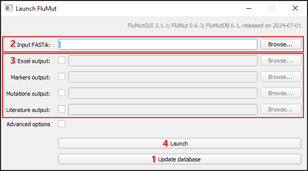
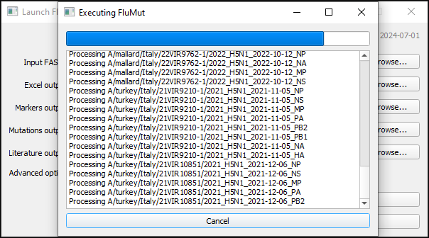

# Basic Usage
FluMutGUI is very simple to use:
1. Update the database to latest version
1. Select the FASTA file you want to analyze (an example can be downloaded [here](https://github.com/izsvenezie-virology/FluMut/releases/latest/download/fasta_input_example.fa))
1.  Select which [outputs](../output) you want (and change the file name if you want)
1. Start the analysis

Wait, when the analysis ends you'll get a message.

